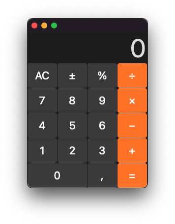
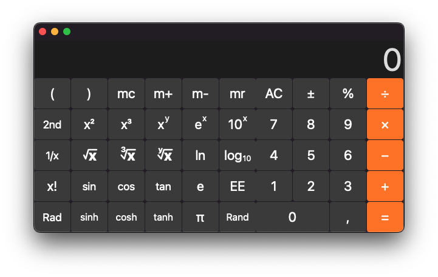
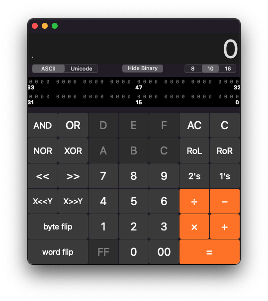

# UDCalc

This is a clone of the MacOSX built-in Calculator.app ported to GNUstep.

# Testing under GNUstep

1. Ensure you have [`xctest`](https://github.com/gnustep/tools-xctest) tool installed.`
2. Go to CalculatorTests and run `make run-tests`
3. If you add new classes to the app that you want to test, please also add them to the CalculatorTests makefile
